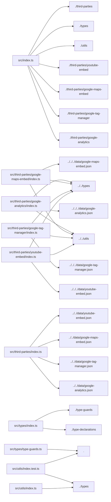

# Project Title: third-party-capital 

## Project Description


Dependencies used in this project: 
   - **semver** : `^7.6.2`

Dev dependencies used in this project: 
   - **@types/jest** : `^29.5.1`
   - **@typescript-eslint/eslint-plugin** : `^5.59.5`
   - **@typescript-eslint/parser** : `^5.59.5`
   - **eslint** : `^8.40.0`
   - **eslint-config-prettier** : `^8.8.0`
   - **husky** : `^8.0.3`
   - **jest** : `^29.5.0`
   - **lint-staged** : `^13.2.1`
   - **prettier** : `2.8.7`
   - **ts-jest** : `^29.1.0`
   - **ts-node** : `^10.9.1`
   - **typescript** : `^5.4.4`
   - **unbuild** : `^2.0.0`

#### Project Version: 3.0.0 


---

## Project File Structure & PEG Graph

```
📁 third-party-capital
├── CONTRIBUTING.md
├── LICENSE
├── README.md
├── composer.json
├── composer.lock
├── data/
│   ├── google-analytics.json
│   ├── google-maps-embed.json
│   ├── google-tag-manager.json
│   └── youtube-embed.json
├── inc/
│   ├── Contracts/
│   │   ├── Arrayable.php
│   │   └── ThirdParty.php
│   ├── Data/
│   │   ├── ThirdPartyData.php
│   │   ├── ThirdPartyDataFormatter.php
│   │   ├── ThirdPartyHtmlAttributes.php
│   │   ├── ThirdPartyHtmlData.php
│   │   ├── ThirdPartyOutput.php
│   │   ├── ThirdPartyScriptData.php
│   │   ├── ThirdPartyScriptOutput.php
│   │   └── ThirdPartySrcValue.php
│   ├── Exception/
│   │   ├── InvalidThirdPartyDataException.php
│   │   └── NotFoundException.php
│   ├── ThirdParties/
│   │   ├── GoogleAnalytics.php
│   │   ├── GoogleMapsEmbed.php
│   │   ├── GoogleTagManager.php
│   │   ├── ThirdPartyBase.php
│   │   └── YouTubeEmbed.php
│   └── Util/
│       ├── HtmlAttributes.php
│       └── JsonDir.php
├── jest.config.ts
├── package-lock.json
├── package.json
├── phpcs.xml.dist
├── phpmd.xml
├── phpstan.neon.dist
├── phpunit.xml.dist
├── src/
│   ├── index.ts
│   ├── third-parties/
│   │   ├── google-analytics/
│   │   │   └── index.ts
│   │   ├── google-maps-embed/
│   │   │   └── index.ts
│   │   ├── google-tag-manager/
│   │   │   └── index.ts
│   │   ├── index.ts
│   │   └── youtube-embed/
│   │       └── index.ts
│   ├── types/
│   │   ├── index.ts
│   │   ├── type-declarations.ts
│   │   └── type-guards.ts
│   └── utils/
│       ├── index.test.ts
│       └── index.ts
├── tests/
│   └── phpunit/
│       ├── bootstrap.php
│       ├── tests/
│       │   ├── Data/
│       │   │   ├── ThirdPartyDataFormatterTest.php
│       │   │   ├── ThirdPartyDataTest.php
│       │   │   ├── ThirdPartyHtmlAttributesTest.php
│       │   │   ├── ThirdPartyHtmlDataTest.php
│       │   │   ├── ThirdPartyOutputTest.php
│       │   │   ├── ThirdPartyScriptDataTest.php
│       │   │   ├── ThirdPartyScriptOutputTest.php
│       │   │   └── ThirdPartySrcValueTest.php
│       │   ├── ThirdParties/
│       │   │   ├── GoogleAnalyticsTest.php
│       │   │   ├── GoogleMapsEmbedTest.php
│       │   │   ├── GoogleTagManagerTest.php
│       │   │   └── YouTubeEmbedTest.php
│       │   └── Util/
│       │       ├── HtmlAttributesTest.php
│       │       └── JsonDirTest.php
│       └── utils/
│           └── TestCase.php
└── tsconfig.json
```

### Module Dependency Graph



---

## React Component Architecture & Explanations

### React Component Breakdown: `<GoogleAnalytics>` 

- **Props**: Receives no explicit props (or uses `children` only).
- **State**: Stateless component.
### React Component Breakdown: `<GoogleMapsEmbed>` 

- **Props**: Receives no explicit props (or uses `children` only).
- **State**: Stateless component.
### React Component Breakdown: `<GoogleTagManager>` 

- **Props**: Receives no explicit props (or uses `children` only).
- **State**: Stateless component.
### React Component Breakdown: `<YouTubeEmbed>` 

- **Props**: Receives no explicit props (or uses `children` only).
- **State**: Stateless component.
---

## AST-Pruned Source Code Repository

> Note: Tailwind classNames and static styles have been pruned according to mode to maximize token efficiency.

### File: `jest.config.ts`

```typescript
module.exports = {
    preset: 'ts-jest',
    testEnvironment: 'node'
};

```

### File: `src/index.ts`

```typescript
export { GoogleAnalytics } from './third-parties/google-analytics';
export { GoogleTagManager } from './third-parties/google-tag-manager';
export { GoogleMapsEmbed } from './third-parties/google-maps-embed';
export { YouTubeEmbed } from './third-parties/youtube-embed';
export * from './utils';
export * from './types';
export * from './third-parties';

```

### File: `src/third-parties/google-analytics/index.ts`

```typescript
import data from '../../../data/google-analytics.json';
import { formatData } from '../../utils';
import type { Data, Inputs } from '../../types';
export const GoogleAnalytics = ({ ...args }: Inputs)=>{
    return formatData(data as Data, args);
};

```

### File: `src/third-parties/google-maps-embed/index.ts`

```typescript
import data from '../../../data/google-maps-embed.json';
import { formatData } from '../../utils';
import type { Data, Inputs } from '../../types';
export const GoogleMapsEmbed = ({ ...args }: Inputs)=>{
    return formatData(data as Data, args);
};

```

### File: `src/third-parties/google-tag-manager/index.ts`

```typescript
import data from '../../../data/google-tag-manager.json';
import { formatData } from '../../utils';
import type { Data, Inputs } from '../../types';
export const GoogleTagManager = ({ ...args }: Inputs)=>{
    return formatData(data as Data, args);
};

```

### File: `src/third-parties/index.ts`

```typescript
import GooglaAnalyticsData from '../../data/google-analytics.json';
import GoogleTagManagerData from '../../data/google-tag-manager.json';
import GoogleMapsEmbedData from '../../data/google-maps-embed.json';
import GoogleYoutubeEmbedData from '../../data/youtube-embed.json';
export { GooglaAnalyticsData, GoogleTagManagerData, GoogleMapsEmbedData, GoogleYoutubeEmbedData };

```

### File: `src/third-parties/youtube-embed/index.ts`

```typescript
import data from '../../../data/youtube-embed.json';
import { formatData } from '../../utils';
import type { Data, Inputs } from '../../types';
export const YouTubeEmbed = ({ ...args }: Inputs)=>{
    return formatData(data as Data, args);
};

```

### File: `src/types/index.ts`

```typescript
export * from './type-declarations';
export * from './type-guards';

```

### File: `src/types/type-declarations.ts`

```typescript
type ScriptStrategy = 'server' | 'client' | 'idle' | 'worker';
type ScriptLocation = 'head' | 'body';
type ScriptAction = 'append' | 'prepend';
export type SrcVal = {
    url: string;
    slugParam?: string;
    params?: Array<string>;
};
export type AttributeVal = string | null | SrcVal | boolean | undefined;
export type HtmlAttributes = {
    src?: SrcVal;
    [key: string]: AttributeVal;
};
type ScriptBase = {
    params?: Array<string>;
    optionalParams?: Record<string, string | number | undefined | null>;
    strategy: ScriptStrategy;
    location: ScriptLocation;
    action: ScriptAction;
    key?: string;
};
export type ExternalScript = ScriptBase & {
    url: string;
};
export type CodeBlock = ScriptBase & {
    code: string;
};
export type Script = ExternalScript | CodeBlock;
export type Scripts = Script[];
export interface Data {
    id: string;
    description: string;
    website?: string;
    html?: {
        element: string;
        attributes: HtmlAttributes;
    };
    stylesheets?: Array<string>;
    scripts?: Scripts;
}
export interface Inputs {
    [key: string]: any;
}
export interface Output {
    id: string;
    description: string;
    website?: string;
    html?: string;
    stylesheets?: Array<string>;
    scripts?: Scripts;
}
export type ConsentValues = {
    ad_user_data?: 'granted' | 'denied';
    ad_personalization?: 'granted' | 'denied';
    ad_storage?: 'granted' | 'denied';
    analytics_storage?: 'granted' | 'denied';
    wait_for_update?: number;
};
export type ConsentType = 'default' | 'update';
export interface GoogleAnalyticsParams {
    id: string;
    l?: string;
    consentType?: ConsentType;
    consentValues?: ConsentValues;
}
export interface GTag {
    (fn: 'js', opt: Date) : void;
    (fn: 'config', opt: string) : void;
    (fn: 'event', opt: string, opt2?: {
        [key: string]: any;
    }) : void;
    (fn: 'set', opt: {
        [key: string]: string;
    }) : void;
    (fn: 'get', opt: string) : void;
    (fn: 'consent', opt: 'default', opt2: {
        [key: string]: string;
    }) : void;
    (fn: 'consent', opt: 'update', opt2: {
        [key: string]: string;
    }) : void;
    (fn: 'config', opt: 'reset') : void;
}
export type DataLayer = Array<Parameters<GTag> | Record<string, unknown>>;
export interface GoogleTagManagerParams {
    id: string;
    l?: string;
    consentType?: ConsentType;
    consentValues?: ConsentValues;
}
interface GoogleTagManagerDataLayerApi {
    name: 'dataLayer';
    set: (opt: {
        [key: string]: string;
    }) => void;
    get: (key: string) => void;
    reset: () => void;
}
type GoogleTagManagerDataLayerStatus = {
    dataLayer: {
        gtmDom: boolean;
        gtmLoad: boolean;
        subscribers: number;
    };
};
export type GoogleTagManagerInstance = GoogleTagManagerDataLayerStatus & {
    [key: string]: {
        callback: () => void;
        dataLayer: GoogleTagManagerDataLayerApi;
    };
};
export interface GoogleTagManagerApi {
    google_tag_manager: GoogleTagManagerInstance;
}
export interface GoogleMapsEmbedParams {
    key: string;
    mode: 'place' | 'view' | 'directions' | 'streetview' | 'search';
    q?: string;
    center?: string;
    zoom?: string;
    maptype?: 'roadmap' | 'satellite';
    language?: string;
    region?: string;
}
export interface YoutubeEmbedAttributes {
    videoid: string;
    playlabel?: string;
}

```

### File: `src/types/type-guards.ts`

**Function Summaries**:
- Line 3: `isExternalScript` -> *Executes logic for function isExternalScript*

```typescript
import { Script, ExternalScript } from '.';
export function isExternalScript(script: Script): script is ExternalScript {
    return (script as ExternalScript).url !== undefined;
}

```

### File: `src/utils/index.test.ts`

```typescript
import { formatUrl, createHtml, formatData, formatCode } from '.';
import type { CodeBlock, Data, ExternalScript } from '../types';
describe('Utils', ()=>{
    describe('formatUrl', ()=>{
        it('should pass user inputs as values for required params', ()=>{
            const oldUrl = 'https://example.com';
            const requiredParams = [
                'unit',
                'type'
            ];
            const args = {
                unit: 'imperial',
                type: 'main'
            };
            const newUrl = formatUrl(oldUrl, requiredParams, args);
            expect(newUrl).toEqual('https://example.com/?unit=imperial&type=main');
        });
        it('should add default value', ()=>{
            const oldUrl = 'https://example.com';
            const requiredParams = [
                'unit',
                'type'
            ];
            const args = {
                unit: 'imperial'
            };
            const optionalParams = {
                type: 'main'
            };
            const newUrl = formatUrl(oldUrl, requiredParams, args, undefined, optionalParams);
            expect(newUrl).toEqual('https://example.com/?unit=imperial&type=main');
        });
    });
    describe('createHtml', ()=>{
        it('should construct a HTML element with no attributes or arguments', ()=>{
            const element = 'lite-element';
            const htmlElement = createHtml(element);
            expect(htmlElement).toEqual('<lite-element></lite-element>');
        });
        it('should construct a HTML element with default attributes and values', ()=>{
            const element = 'lite-element';
            const defaultAttrs = {
                id: '123',
                loading: 'lazy'
            };
            const htmlElement = createHtml(element, defaultAttrs);
            expect(htmlElement).toEqual('<lite-element id="123" loading="lazy"></lite-element>');
        });
        it('should construct a HTML element passing parameters to any required src URLs', ()=>{
            const element = 'lite-element';
            const defaultAttrs = {
                id: '123',
                src: {
                    url: 'https://example.com/',
                    params: [
                        'unit',
                        'type'
                    ]
                }
            };
            const urlQueryParamInputs = {
                unit: 'imperial',
                type: 'main'
            };
            const htmlElement = createHtml(element, defaultAttrs, {}, urlQueryParamInputs);
            expect(htmlElement).toEqual('<lite-element id="123" src="https://example.com/?unit=imperial&type=main"></lite-element>');
        });
        it('should construct a HTML element overwriting default attribute values with user-defined inputs', ()=>{
            const element = 'lite-element';
            const defaultAttrs = {
                id: '123',
                src: {
                    url: 'https://example.com/',
                    params: [
                        'unit',
                        'type'
                    ]
                }
            };
            const htmlAttrInputs = {
                src: 'https://example.com/overwrite'
            };
            const htmlElement = createHtml(element, defaultAttrs, htmlAttrInputs);
            expect(htmlElement).toEqual('<lite-element id="123" src="https://example.com/overwrite"></lite-element>');
        });
    });
    describe('formatData', ()=>{
        it('should correctly format and overwrite data and inputs', ()=>{
            const data = {
                id: 'third-party',
                description: 'Description',
                html: {
                    element: 'iframe',
                    attributes: {
                        loading: 'lazy',
                        src: {
                            url: 'https://www.example.com/',
                            params: [
                                'id'
                            ]
                        },
                        width: '100',
                        height: '100'
                    }
                }
            };
            const inputs = {
                id: 'props.id',
                loading: 'auto',
                width: '150'
            };
            const result = formatData(data, inputs);
            expect(result.html).toEqual('<iframe loading="auto" src="https://www.example.com/?id=props.id" width="150" height="100"></iframe>');
            expect(result.scripts).toEqual(undefined);
        });
        it('should pass scripts and correctly assign params if available', ()=>{
            const data = {
                id: 'third-party',
                description: 'Description',
                html: {
                    element: 'iframe',
                    attributes: {
                        loading: 'lazy'
                    }
                },
                scripts: [
                    {
                        url: 'https://www.example.com',
                        params: [
                            'id'
                        ],
                        strategy: 'worker',
                        location: 'head',
                        action: 'append'
                    }
                ]
            };
            const inputs = {
                id: 'userDefinedId'
            };
            const result = formatData(data as Data, inputs);
            expect(result.html).toEqual('<iframe loading="lazy"></iframe>');
            expect(result.scripts).not.toEqual(undefined);
            expect(result.scripts!.length).toEqual(1);
            expect((result.scripts![0] as ExternalScript).url).toEqual('https://www.example.com/?id=userDefinedId');
        });
        it('should forward all additional inputs as html attributes if not used elsewhere', ()=>{
            const data = {
                id: 'third-party',
                description: 'Description',
                html: {
                    element: 'iframe',
                    attributes: {
                        loading: 'lazy',
                        width: '100',
                        height: '100'
                    }
                }
            };
            const inputs = {
                id: 'props.id',
                loading: 'auto',
                width: '150'
            };
            const result = formatData(data, inputs);
            expect(result.html).toEqual('<iframe loading="auto" width="150" height="100" id="props.id"></iframe>');
            expect(result.scripts).toEqual(undefined);
        });
        it('should include the user inputted slug to the src URL if provided as a parameter', ()=>{
            const data = {
                id: 'third-party',
                description: 'Description',
                html: {
                    element: 'iframe',
                    attributes: {
                        loading: 'lazy',
                        src: {
                            url: 'https://www.example.com/',
                            slugParam: 'inputSlug'
                        }
                    }
                }
            };
            const inputs = {
                inputSlug: 'cool-slug'
            };
            const result = formatData(data, inputs);
            expect(result.html).toEqual('<iframe loading="lazy" src="https://www.example.com/cool-slug"></iframe>');
            expect(result.scripts).toEqual(undefined);
        });
        it('should replace the already existing slug if the user includes a slug parameter slug', ()=>{
            const data = {
                id: 'third-party',
                description: 'Description',
                html: {
                    element: 'iframe',
                    attributes: {
                        loading: 'lazy',
                        src: {
                            url: 'https://www.google.com/maps/embed/v1/place',
                            slugParam: 'mode',
                            params: [
                                'key'
                            ]
                        }
                    }
                }
            };
            const inputs = {
                mode: 'view',
                key: '123'
            };
            const result = formatData(data, inputs);
            expect(result.html).toEqual('<iframe loading="lazy" src="https://www.google.com/maps/embed/v1/view?key=123"></iframe>');
            expect(result.scripts).toEqual(undefined);
        });
        it('should replace with default values when needed', ()=>{
            const data = {
                id: 'third-party',
                description: 'Description',
                html: {
                    element: 'iframe',
                    attributes: {
                        loading: 'lazy',
                        src: {
                            url: 'https://www.google.com/maps/embed/v1/place',
                            slugParam: 'mode',
                            params: [
                                'key'
                            ]
                        }
                    }
                },
                scripts: [
                    {
                        code: 'window[{{hello}}]=window[{{hello}}]||[];console.log({{world}})',
                        optionalParams: {
                            hello: 'hoho'
                        },
                        params: [
                            'world'
                        ],
                        strategy: 'worker',
                        location: 'head',
                        action: 'append',
                        key: 'setup'
                    } as CodeBlock
                ]
            };
            const result = formatData(data, {
                test: 'hello',
                world: 'earth',
                key: 404
            });
            const script = result.scripts![0] as CodeBlock;
            expect(script.code).toEqual('window["hoho"]=window["hoho"]||[];console.log("earth")');
            expect(result.html).toEqual('<iframe loading="lazy" src="https://www.google.com/maps/embed/v1/place?key=404" test="hello"></iframe>');
        });
    });
    describe('formatCode', ()=>{
        const inputs = [
            {
                input: 'window[{{l}}]=window[{{l}}]||[];',
                params: {
                    l: 'some-datalayer'
                },
                output: `window["some-datalayer"]=window["some-datalayer"]||[];`
            },
            {
                input: '{{number}}+1',
                params: {
                    number: 4
                },
                output: `4+1`
            },
            {
                input: '{{bool}}',
                params: {
                    bool: false
                },
                output: `false`
            },
            {
                input: '{{val}}',
                params: {
                    val: null
                },
                output: `undefined`
            },
            {
                input: 'window[{{l}}]=window[{{l}}]||[];',
                output: `window[undefined]=window[undefined]||[];`
            },
            {
                input: '{{obj}}',
                params: {
                    obj: {
                        key: 'value'
                    }
                },
                output: `{"key":"value"}`
            },
            {
                input: '{{#enabled}}window.func("enable", true);{{/enabled}}',
                params: {
                    enabled: true
                },
                output: `window.func("enable", true);`
            },
            {
                input: '{{#enabled}}window.func("enable", true);{{/enabled}}',
                params: {
                    enabled: false
                },
                output: ``
            },
            {
                input: '{{#name}}window.func("setName", {{name}});{{/name}}',
                params: {
                    name: 'James'
                },
                output: `window.func("setName", "James");`
            },
            {
                input: '{{#name}}window.func("setName", {{name}});{{/name}}',
                params: {
                    name: null
                },
                output: ``
            },
            {
                input: '{{{#name}}}window.func("setName", {{name}});{{{/name}}}',
                params: {
                    name: 'James'
                },
                output: `{}window.func("setName", "James");{}`
            }
        ];
        it.each(inputs)('should replace the input and stringify it', ({ input, output, params })=>{
            expect(formatCode(input, params)).toEqual(output);
        });
        it.each(inputs)('should replace the input and stringify it with the default value', ({ input, output, params })=>{
            expect(formatCode(input, undefined, params)).toEqual(output);
        });
        it('should replace the input and stringify it with the default value', ()=>{
            const input = 'window[{{l}}]=window[{{l}}]||[];';
            expect(formatCode(input, {
                l: 'test'
            }, {
                l: 'dataLayer'
            })).toMatchInlineSnapshot(`"window["test"]=window["test"]||[];"`);
        });
    });
});

```

### File: `src/utils/index.ts`

**Function Summaries**:
- Line 10: `filterArgs` -> *Filters an input object to return a new object containing only properties whose keys are either specified in the `selectedArgs` list or, if inverse is true, all properties not listed in that array.*
- Line 28: `formatUrl` -> *Constructs a complete and parameterized URL string by optionally setting a slug path, then appending required and optional query parameters using values derived from multiple source maps.*
- Line 58: `formatCode` -> *Processes a template string by resolving variable-based conditional blocks using provided arguments and then replacing all remaining simple placeholders with their JSON-stringified values.*
- Line 83: `createHtml` -> *Builds a complete HTML tag string using a specified element name, accepting initial attributes (which includes specialized URL handling for `src`), and allowing subsequent arguments to overwrite or append additional attributes.*
- Line 122: `formatData` -> *Transforms raw data structure by injecting resolved values into scripts and HTML elements using provided arguments.*

```typescript
import type { Data, Inputs, AttributeVal, HtmlAttributes, Output } from '../types';
import { isExternalScript } from '../types';
function filterArgs(args: Inputs, selectedArgs?: string[], inverse: boolean = false) {
    if (!selectedArgs) return {};
    return Object.keys(args).filter((key)=>inverse ? !selectedArgs.includes(key) : selectedArgs.includes(key)).reduce((obj, key)=>{
        obj[key] = args[key];
        return obj;
    }, {} as Record<string, any>);
}
export function formatUrl(url: string, params?: string[], args?: Inputs, slug?: Inputs, optionalParams?: Inputs) {
    const newUrl = slug && Object.keys(slug).length > 0 ? new URL(Object.values(slug)[0], url) : new URL(url);
    if (params && args) {
        params.forEach((param: string)=>{
            if (args[param]) newUrl.searchParams.set(param, args[param]);
        });
    }
    if (optionalParams) {
        Object.keys(optionalParams).forEach((key: string)=>{
            if (args?.[key]) newUrl.searchParams.set(key, args[key]);
            else if (optionalParams[key]) {
                newUrl.searchParams.set(key, optionalParams[key]);
            }
        });
    }
    return newUrl.toString();
}
export function formatCode(code: string, args?: Inputs, optionalParams?: Inputs) {
    code = code.replace(/{{#([^{}]+?)}}(.*){{\/\1}}/g, (match, name, innerCode)=>{
        if (args?.[name] || optionalParams?.[name]) {
            return innerCode;
        }
        return '';
    });
    return code.replace(/{{[^#/](.*?)}}/g, (match)=>{
        const name = match.split(/{{|}}/).filter(Boolean)[0];
        return JSON.stringify(args?.[name] ?? optionalParams?.[name] ?? undefined);
    });
}
export function createHtml(element: string, attributes?: HtmlAttributes, htmlAttrArgs?: Inputs, urlQueryParamArgs?: Inputs, slugParamArg?: Inputs) {
    if (!attributes) return `<${element}></${element}>`;
    const formattedAttributes: any = attributes.src?.url ? {
        ...attributes,
        src: formatUrl(attributes.src.url, attributes.src.params, urlQueryParamArgs, slugParamArg)
    } : attributes;
    const htmlAttributes = Object.keys({
        ...formattedAttributes,
        ...htmlAttrArgs
    }).reduce((acc, name)=>{
        const userVal = htmlAttrArgs?.[name];
        const defaultVal = formattedAttributes[name];
        const finalVal = userVal ?? defaultVal;
        const attrString = (finalVal as AttributeVal) === true ? name : `${name}="${finalVal}"`;
        return finalVal ? acc + ` ${attrString}` : acc;
    }, '');
    return `<${element}${htmlAttributes}></${element}>`;
}
export function formatData(data: Data, args: Inputs): Output {
    const allScriptParams = data.scripts?.reduce((acc, script)=>[
            ...acc,
            ...(Array.isArray(script.params) ? script.params : []),
            ...(script.optionalParams ? Object.keys(script.optionalParams) : [])
        ], [] as string[]);
    const scriptUrlParamInputs = filterArgs(args, allScriptParams);
    const htmlUrlParamInputs = filterArgs(args, data.html?.attributes.src?.params);
    const htmlSlugParamInput = filterArgs(args, [
        data.html?.attributes.src?.slugParam!
    ]);
    const htmlAttrInputs = filterArgs(args, [
        ...Object.keys(scriptUrlParamInputs),
        ...Object.keys(htmlUrlParamInputs),
        ...Object.keys(htmlSlugParamInput)
    ], true);
    return {
        ...data,
        html: data.html ? createHtml(data.html.element, data.html.attributes, htmlAttrInputs, htmlUrlParamInputs, htmlSlugParamInput) : undefined,
        scripts: data.scripts ? data.scripts.map((script)=>{
            return isExternalScript(script) ? {
                ...script,
                url: formatUrl(script.url, script.params, args, undefined, script.optionalParams)
            } : {
                ...script,
                code: formatCode(script.code, args, script.optionalParams)
            };
        }) : undefined
    };
}

```


