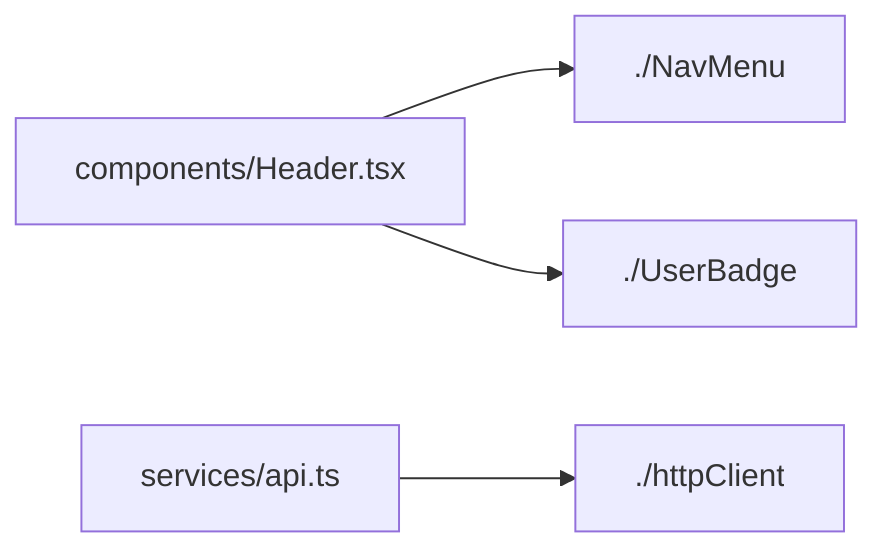

import { Tabs, Tab } from '@rspress/core/theme';
import ConfigGenerator from '../../components/ConfigGenerator'


# `urai.config` API Reference <span className="urai-tamil-wordmark">(நிரலாக்க இடைமுகக் குறிப்பேடு)</span>

`urai-ecma` reads its runtime configuration from `urai.config.jsonc` or `urai.config.json` in your current working directory. The parser is powered by the Rust **`json5`** engine, natively supporting single-line comments (`//`), multi-line comments (`/* */`), trailing commas, and unquoted identifiers.


## Configuration Precedence Architecture

`urai-ecma` applies configuration via a **strict 4-tier waterfall model**:

```
┌────────────────────────────────────────────────────────┐
│ 1. CLI Arguments (--tailwind-mode, -i, -o, etc.)      │ ◄ Highest Priority
└───────────────────────────┬────────────────────────────┘
                            │ (falls back to)
┌───────────────────────────▼────────────────────────────┐
│ 2. Environment Variables (e.g., OLLAMA_ENDPOINT)       │
└───────────────────────────┬────────────────────────────┘
                            │ (falls back to)
┌───────────────────────────▼────────────────────────────┐
│ 3. urai.config.jsonc / urai.config.json File           │
└───────────────────────────┬────────────────────────────┘
                            │ (falls back to)
┌───────────────────────────▼────────────────────────────┐
│ 4. Rust Compiler Defaults (e.g., threshold = 96)       │ ◄ Base Default
└────────────────────────────────────────────────────────┘
```

When an option is specified via the CLI, it **overrides** the configuration file and environment variables. If an option is omitted everywhere, the internal Rust engine falls back to its deterministic defaults.

---

## Master Template (`urai.config.jsonc`)

Generate this file automatically by running:
```bash
urai-ecma create
```

```jsonc
{
  "$schema": "https://sanjaiyan-dev.github.io/urai-ecma/json-schema/v0/config.schema.json",

  // Path to the project directory or single source file
  "input_project": "./src",

  // Target output Markdown file path
  "output_file": "./output.md",

  // Ollama local endpoint URL (Optional, e.g., "http://localhost:11434")
  "ollama_endpoint": "http://localhost:11434",

  // Ollama Model Name (e.g., "gemma4", "ornith", "llama3.2")
  "ollama_modelname": "gemma4",

  // Tailwind CSS / className pruning mode: "remove" | "remove_aggr" | "summarize" | "preserve"
  // "remove": strips static class strings exceeding threshold while keeping dynamic expressions.
  // "remove_aggr": aggressively removes class strings even if below character threshold.
  // "summarize": sends class strings exceeding threshold to Ollama for 1-line style descriptions.
  // "preserve": keeps classNames untouched.
  "tailwind_mode": "remove",

  // Character length threshold for Tailwind pruning (default: 96 characters)
  "tailwind_threshold": 96,

  // Summarize function block bodies using local Ollama or fallback to JSDoc comments
  "summarize_functions": true,

  // Line count threshold to trigger function summarization (default: 5 lines)
  "summarize_functions_threshold": 5,

  // Extract and generate Express/Fastify/Next.js/NestJS API Route Table
  "generate_route_table": true,

  // Analyze React / React Native components and output detailed explanations
  "analyze_react_components": true,

  // Generate ASCII File Structure & Module Dependency Graph
  "generate_file_graph": true
}
```

---

## Detailed Field Specification

### `$schema`
- **Type**: `string` (URI)
- **Required**: `No` (Recommended)
- **Default**: `"https://sanjaiyan-dev.github.io/urai-ecma/json-schema/v0/config.schema.json"`

Enables JSON Schema validation and intelligent IntelliSense autocompletion in VS Code, Cursor, Windsurf, and JetBrains IDEs. As you type inside `urai.config.jsonc`, your editor will surface field descriptions, type checks, and valid enum values.

---

### `input_project`
- **Type**: `string` (File Path or Directory Path)
- **Required**: `Yes` (if not supplied via `-i` / `--input-project`)
- **CLI Flag**: `-i <PATH>`, `--input-project <PATH>`
- **Default**: `None`

Specifies the root directory of your JavaScript/TypeScript project or the path to an individual source file.
- **Directory Mode** (`"./src"`): Scans all `.js`, `.jsx`, `.ts`, `.tsx`, `.mjs`, `.cjs` files recursively using `ignore::WalkBuilder`, respecting `.gitignore`, `.ignore`, and skipping build directories (`node_modules`, `dist`, `build`, `target`).
- **Single File Mode** (`"./src/App.tsx"`): Analyzes and optimizes only that file.

```jsonc
"input_project": "./packages/client/src"
```

:::warning Path Resolution
Relative paths are resolved relative to the current working directory from which `urai-ecma` is invoked, **not** the location of the config file.
:::

---

### `output_file`
- **Type**: `string` (File Path)
- **Required**: `Yes` (if not supplied via `-o` / `--output-file`)
- **CLI Flag**: `-o <PATH>`, `--output-file <PATH>`
- **Default**: `None`

The destination path where the assembled, token-dense Markdown prompt will be written. If the file already exists, `urai-ecma` truncates and overwrites it. If parent directories do not exist, they will be created automatically.

```jsonc
"output_file": "./prompts/context.md"
```

---

### `ollama_endpoint`
- **Type**: `string` (HTTP URL)
- **Required**: `No`
- **CLI Flag**: `-e <URL>`, `--ollama-endpoint <URL>`
- **Env Variable**: `OLLAMA_ENDPOINT`
- **Default**: `http://localhost:11434`

The base URL of an active local or remote Ollama server (typically `http://localhost:11434`). 

- When provided, `urai-ecma` initializes the **`foyer` Hybrid Cache** and uses the Ollama instance for:
  1. Summarizing function bodies that lack JSDoc comments (`summarize_functions: true`).
  2. Generating natural language style descriptions for Tailwind classes (`tailwind_mode: "summarize"`).
- When omitted (`null`), `urai-ecma` runs in **pure offline AST mode**, falling back to JSDoc extraction or generating concise structural stubs without making network calls.

```jsonc
"ollama_endpoint": "http://127.0.0.1:11434"
```

---

### `ollama_modelname`
- **Type**: `string`
- **Required**: `No`
- **CLI Flag**: `-m <NAME>`, `--ollama-modelname <NAME>`
- **Default**: `"gemma4"` (Internal Rust fallback) / `"gemma4"` (Config template)

The specific model tag pulled into your Ollama instance to use for semantic code summarization. High-speed, instruction-following small parameter models are recommended to minimize latency.

| Recommended Model | Best For | Typical Latency / Function |
| :--- | :--- | :--- |
| **`gemma4:latest`** / **`gemma4`** | Maximum throughput, low VRAM footprint | ~80ms |
| **`llama3.2:3b`** / **`llama3.2`** | High precision, complex method logic | ~110ms |
| **`qwen2.5-coder:1.5b`** | Dedicated code understanding | ~70ms |

```jsonc
"ollama_modelname": "gemma4:latest"
```

---

### `tailwind_mode`
- **Type**: `string` (Enum)
- **Allowed Values**: `"remove"` | `"remove_aggr"` | `"summarize"` | `"preserve"`
- **CLI Flag**: `--tailwind-mode <MODE>`
- **Default**: `"remove"`

Controls how the SWC JSX Visitor (`ReactJsxPruner`) handles `className` and `style` attributes on JSX elements:

```
JSX Opening Element: <div className="..." style="...">
                         │
        ┌────────────────┴────────────────┬────────────────┐
        ▼                                 ▼                ▼
     "remove"                      "summarize"        "preserve"
(Strip static strings > 96 chars;  (Prompt Ollama:    (Keep untouched)
 keep dynamic clsx / ternaries)    /* UI: Card layout */)
```

#### Mode Breakdown

#### 1. `"remove"` <span className="urai-badge-terracotta">Default</span>
Strips static string literals when their length exceeds `tailwind_threshold`. **Crucially preserves dynamic expressions** (`JSXExprContainer`) such as `clsx()`, `cn()`, and ternary conditions.
```tsx
// Before
<div className="flex flex-col items-center p-6 bg-white rounded-xl shadow-lg border border-slate-200 hover:shadow-2xl transition-all duration-300 w-full max-w-sm" />
<span className={clsx("text-sm", isActive ? "text-emerald-500" : "text-zinc-500")} />

// After
<div />
<span className={clsx("text-sm", isActive ? "text-emerald-500" : "text-zinc-500")} />
```

#### 2. `"remove_aggr"`
Aggressively strips static `className` strings **regardless of character count**. Ideal for backend migrations, data modeling, or refactoring where CSS is irrelevant.

#### 3. `"summarize"`
Passes class strings exceeding `tailwind_threshold` to the configured Ollama model with a specialized system prompt, replacing verbose strings with a single-line natural language descriptor:
```tsx
// After
<div className="/* UI: Frosted glass card layout with hover shadow */" />
```

#### 4. `"preserve"`
Leaves all `className` and `style` attributes intact. Use this when asking an LLM to debug responsive styling or pixel-perfect layout issues.

---

### `tailwind_threshold`
- **Type**: `number` (Positive integer)
- **Required**: `No`
- **CLI Flag**: `--tailwind-threshold <CHARS>`
- **Default**: `96`

The minimum character count of a static `className` string required to trigger pruning in `"remove"` and `"summarize"` modes. 

- Strings **shorter** than this threshold (e.g., `"flex items-center"`) are kept intact.
- Strings **equal to or longer** than this threshold are pruned or summarized.

```jsonc
"tailwind_threshold": 64
```

---

### `summarize_functions`
- **Type**: `boolean`
- **Required**: `No`
- **CLI Flag**: `--summarize-functions <BOOL>`
- **Default**: `true`

Enables semantic function and class method pruning. When set to `true`:
1. The visitor inspects functions (`FnDecl`, `ArrowExpr`, `ClassMethod`, `PrivateMethod`, constructors).
2. It checks for **JSDoc annotations** (`@description`, `@param`, `@return`).
3. If no JSDoc is present and the function line count exceeds `summarize_functions_threshold`, it queries Ollama for a 1-sentence summary.
4. The internal body statements are cleared using `is_structural_stub_stmt`—retaining hooks (`use*`), timers (`setTimeout`), DOM listeners, and JSX return statements—and a summary expression comment is appended:
   ```ts
   /* "Validates authorization token and returns user profile payload." */
   ```

```jsonc
"summarize_functions": true
```

---

### `summarize_functions_threshold`
- **Type**: `number` (Positive integer)
- **Required**: `No`
- **CLI Flag**: `--summarize-functions-threshold <LINES>`
- **Default**: `5`

The line count threshold required to trigger function summarization. Short utility functions (e.g., 2–4 lines) are kept intact without calling Ollama.

```jsonc
"summarize_functions_threshold": 8
```

---

### `generate_route_table`
- **Type**: `boolean`
- **Required**: `No`
- **CLI Flag**: `--generate-route-table <BOOL>`
- **Default**: `true`

Enables the AST `RouteVisitor` to discover API route handlers and output a structured Markdown routing table:
- **Next.js App Router**: Discovers exported HTTP verbs (`GET`, `POST`, `PUT`, `DELETE`, `PATCH`, `HEAD`, `OPTIONS`) from `app/**/route.ts` and `pages/api/**`.
- **NestJS**: Discovers `@Controller('prefix')` and method-level decorators (`@Get`, `@Post`, `@Put`, `@Delete`, etc.).
- **Express & Fastify**: Discovers `app.get()`, `router.post()`, `fastify.delete()`, including template literals (e.g., `` `/users/${id}` ``).

```markdown
## Backend API Route Table
| Framework | Method | Path | Handler | File Location |
| :--- | :--- | :--- | :--- | :--- |
| **Next.js** | `GET` | `/api/v1/auth` | `GET` | `app/api/v1/auth/route.ts:4` |
| **NestJS** | `POST` | `/billing/checkout` | `BillingController::checkout` | `billing.controller.ts:12` |
```

---

### `analyze_react_components`
- **Type**: `boolean`
- **Required**: `No`
- **CLI Flag**: `--analyze-react-components <BOOL>`
- **Default**: `true`

Enables `ReactComponentAnalyzer`. Introspects uppercase functional and arrow components to extract:
- **Props**: Destructured keys and explicit TypeScript type annotations (`resolve_ts_type`).
- **State Variables**: Variable and setter pairs declared via `useState`.
- **Hooks & Side-Effects**: Detects and counts `useEffect`, `useLayoutEffect`, and custom `use*` hooks.
- **Event Handlers**: Attaches registered event listeners (`onClick`, `onChange`, `onSubmit`).
- **Rendered JSX Hierarchy**: Lists rendered child element tag names.

```markdown
### React Component Breakdown: `<CheckoutDrawer>` 
- **Props**: `isOpen` (type: `boolean`), `onClose` (type: `() => void`)
- **State Management**: Manages state `step` via setter `setStep`.
- **Hooks**: Uses `useState, useEffect` (Total Side-Effects: 1).
- **Event Handlers**: Handlers attached: `onClick, onKeyDown`.
- **Rendered JSX Tree**: `<Drawer>, <DrawerOverlay>, <DrawerContent>`
```

---

### `generate_file_graph`
- **Type**: `boolean`
- **Required**: `No`
- **CLI Flag**: `--generate-file-graph <BOOL>`
- **Default**: `true`

Constructs and injects two architectural overviews into the final prompt:
1. **ASCII Project Directory Tree**: A clean visual file tree respecting `.gitignore` rules.
2. **Mermaid.js Dependency Graph**: Built using `petgraph::graph::UnGraph`, tracking relative ESM `import ... from './path'` relationships across modules.



---

## Complete CLI Flag Mapping

Every config option maps directly to an equivalent CLI flag:

| JSON Key | CLI Equivalent | Type | Default |
| :--- | :--- | :--- | :--- |
| `input_project` | `-i`, `--input-project <PATH>` | `PathBuf` | *Required* |
| `output_file` | `-o`, `--output-file <PATH>` | `PathBuf` | *Required* |
| `ollama_endpoint` | `-e`, `--ollama-endpoint <URL>` | `Url` | `null` |
| `ollama_modelname` | `-m`, `--ollama-modelname <NAME>` | `string` | `"gemma2"` |
| `tailwind_mode` | `--tailwind-mode <MODE>` | `string` | `"remove"` |
| `tailwind_threshold` | `--tailwind-threshold <CHARS>` | `usize` | `96` |
| `summarize_functions` | `--summarize-functions <BOOL>` | `bool` | `true` |
| `summarize_functions_threshold` | `--summarize-functions-threshold <LINES>` | `usize` | `5` |
| `generate_route_table` | `--generate-route-table <BOOL>` | `bool` | `true` |
| `analyze_react_components` | `--analyze-react-components <BOOL>` | `bool` | `true` |
| `generate_file_graph` | `--generate-file-graph <BOOL>` | `bool` | `true` |

---

## Production Recipes

<Tabs>
  <Tab label="Full-Stack Next.js (Fast / Offline)">
```jsonc
{
  "$schema": "https://sanjaiyan-dev.github.io/urai-ecma/json-schema/v0/config.schema.json",
  "input_project": "./src",
  "output_file": "./prompt.md",
  "tailwind_mode": "remove",
  "tailwind_threshold": 80,
  "summarize_functions": false, // No Ollama required
  "generate_route_table": true,
  "analyze_react_components": true,
  "generate_file_graph": true
}
```
  </Tab>

  <Tab label="Design System & UI Review (Ollama Powered)">
```jsonc
{
  "$schema": "https://sanjaiyan-dev.github.io/urai-ecma/json-schema/v0/config.schema.json",
  "input_project": "./packages/ui/src",
  "output_file": "./ui-prompt.md",
  "ollama_endpoint": "http://localhost:11434",
  "ollama_modelname": "gemma2",
  "tailwind_mode": "summarize", // Converts styles to 1-line descriptions
  "tailwind_threshold": 64,
  "summarize_functions": true,
  "summarize_functions_threshold": 5,
  "generate_route_table": false,
  "analyze_react_components": true,
  "generate_file_graph": true
}
```
  </Tab>

  <Tab label="Pure Backend Microservice (NestJS / Fastify)">
```jsonc
{
  "$schema": "https://sanjaiyan-dev.github.io/urai-ecma/json-schema/v0/config.schema.json",
  "input_project": "./apps/api/src",
  "output_file": "./api-prompt.md",
  "tailwind_mode": "preserve", // No JSX present
  "summarize_functions": true,
  "summarize_functions_threshold": 8,
  "generate_route_table": true,
  "analyze_react_components": false,
  "generate_file_graph": true
}
```
  </Tab>
</Tabs>

---

## 🛠️ Interactive Configuration Architect

Design, tweak, test presets, and export your configuration file right inside this interactive studio:

<ConfigGenerator />
